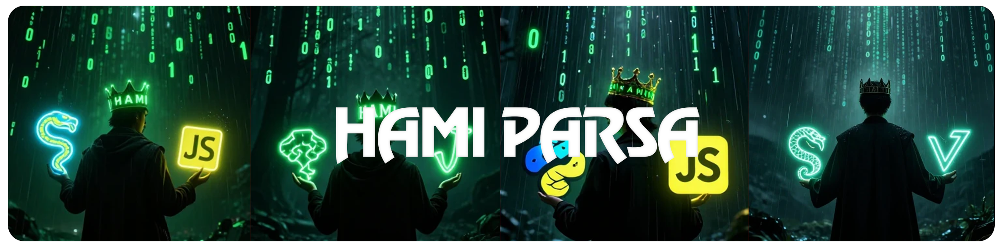
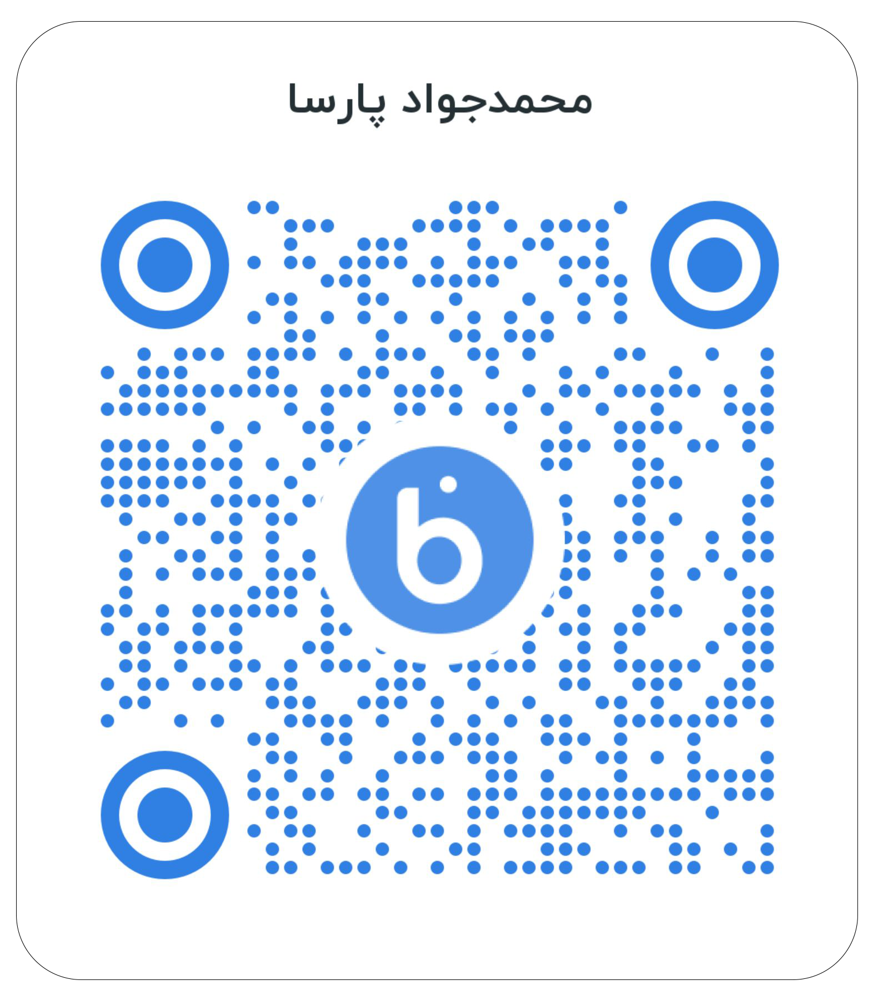
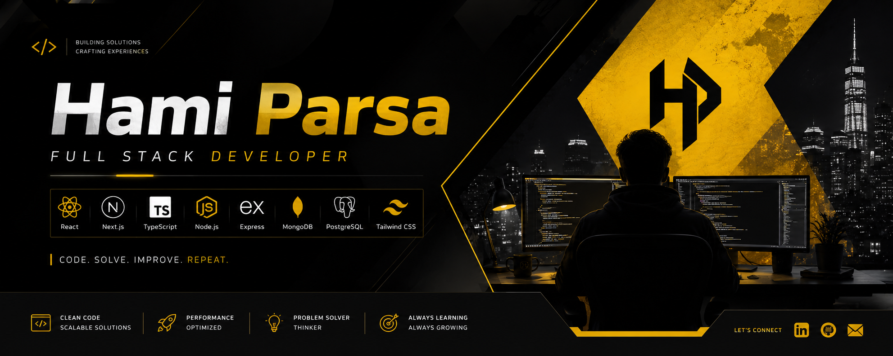

  

    

 
 

# 💫 About Me:

---

👋 **Front-End Developer** · Future Full-Stack · Tech Creator

---

### 🎯 Current Focus

- Mastering **Next.js** & **TypeScript** in real-world scenarios
- On the path to becoming **Full-Stack Developer**
- Building projects with production mindset from day one

---

### 🧠 My Vision

> I don't want to just *write code for websites*.  
> I want to **build things that matter** — tools, platforms, and systems that solve real problems.

First, master the craft (Front-End → Full-Stack).  
Then, build meaningful products.  
Eventually, make a real impact in the **tech world** — beyond just being "a web developer".

---

### 🚀 What Drives Me

- Curiosity about how great software is built
- The desire to grow beyond frameworks
- The belief that a developer can become a creator

---

### 🎯 Mission

**Short-term:** Become a strong Full-Stack Developer who can build complete products from zero.

**Long-term:** Be part of — or lead — projects that **change the way people interact with technology**.

---

### 🌱 Mindset

> Learn → Build → Refactor → Ship

Every project must be resume-ready, portfolio-worthy, and built with intent.

---

⚡ *I start as a Front-End Developer. But that's not where I end.*

 
 

    
### 🔗 CONNECT // ONLINE

### 💻 Tech Stack // STACK OF A DEVELOPER

  <!-- Front-End -->
  
  
  
  
  

  <!-- Animation & UI -->
  
  

  <!-- Tools -->
  
  
  

  <!-- Header Animation -->
  
  
  <h3>💖 Support My Journey</h3>
  
If you enjoy my projects, a small donation fuels my passion to build more amazing things! 💣✨

  
   
  
  <!-- QR Code Section with Neon Border -->
  
  

   
  
  
  
Scan QrCode For Donate

  
   
  
  <!-- Footer Animation -->
  

## 🚀 My Top Projects

### 📱 My-Messenger
> **Real-time Messaging App**  
> `Next.js` · `Tailwind` · `TypeScript`  
> 💬 Seamless communication with instant state management.  
> [🔗 Repo](https://github.com/HamiParsa/My-Messenger) · [🌐 Live](https://hamiparsa.github.io/My-Messenger/)

---

### 🚗 Tesla Configurator
> **Interactive Car Builder**  
> `Next.js` · `Tailwind` · `TypeScript`  
> 🎨 High-performance UI with smooth animations & dynamic configuration.  
> [🔗 Repo](https://github.com/HamiParsa/Tesla) · [🌐 Live](https://hamiparsa.github.io/Tesla/)

---

### 👤 HamiParsa (Portfolio)
> **Personal Portfolio & Bio**  
> `Next.js` · `Tailwind` · `TypeScript`  
> ✨ Showcasing UI/UX skills and professional journey.  
> [🔗 Repo](https://github.com/HamiParsa/Profile-Bio) · [🌐 Live](https://hamiparsa.github.io/Profile-Bio/)

---

### 🎨 Art-The-Clown
> **Creative UI Experiment**  
> `Next.js` · `Tailwind` · `TypeScript`  
> 🤡 A unique graphic-driven interface exploring artistic web design.  
> [🔗 Repo](https://github.com/HamiParsa/Art-The-Clown) · [🌐 Live](https://hamiparsa.github.io/Art-The-Clown/)

---

### 🕹️ GTA San Andreas UI
> **Gaming-Inspired Interface**  
> `Next.js` · `Tailwind` · `TypeScript`  
> 🎮 Interactive demo inspired by classic game HUDs and aesthetics.  
> [🔗 Repo](https://github.com/HamiParsa/Gta-SanAndreas) · [🌐 Live](https://hamiparsa.github.io/Gta-SanAndreas/)

---

### 🎮 Rockstar Games Theme
> **Gaming-Themed Frontend**  
> `Next.js` · `Tailwind` · `TypeScript`  
> 🎲 Creative design elements inspired by the Rockstar universe.  
> [🔗 Repo](https://github.com/HamiParsa/Rockstar-Games) · [🌐 Live](https://hamiparsa.github.io/Rockstar-Games/)

> 💡 _All projects built with clean architecture, responsive design, and production-ready mindset._  
 
  

    

 
 
  

# 📊 GitHub Stats

  <table>
    <tr>
      <td align="center" style="padding: 5px; border: none; width: 33%;">
        <!-- GitHub Stats -->
        
      </td>
      <td align="center" style="padding: 5px; border: none; width: 33%;">
        <!-- GitHub Streak -->
        
      </td>
      <td align="center" style="padding: 5px; border: none; width: 33%;">
        <!-- Top Languages -->
        
      </td>
    </tr>
  </table>

# 🏆 GitHub Trophies

  

<!-- Proudly created with GPRM ( https://gprm.itsvg.in ) -->

## 👾 Pacman Maze 

<picture>
  <source media="(prefers-color-scheme: dark)" srcset="https://raw.githubusercontent.com/HamiParsa/HamiParsa/output/pacman-contribution-graph-dark.svg">
  <source media="(prefers-color-scheme: light)" srcset="https://raw.githubusercontent.com/HamiParsa/HamiParsa/output/pacman-contribution-graph.svg">
  
</picture>
